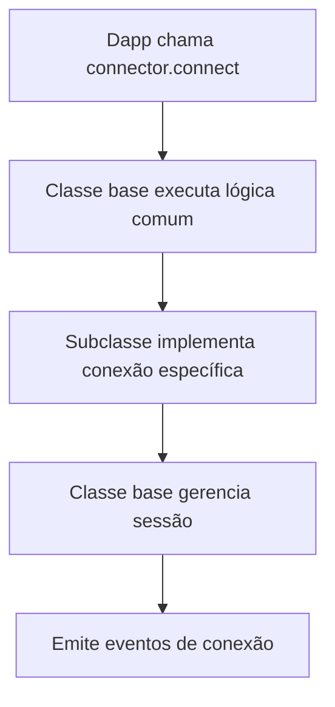
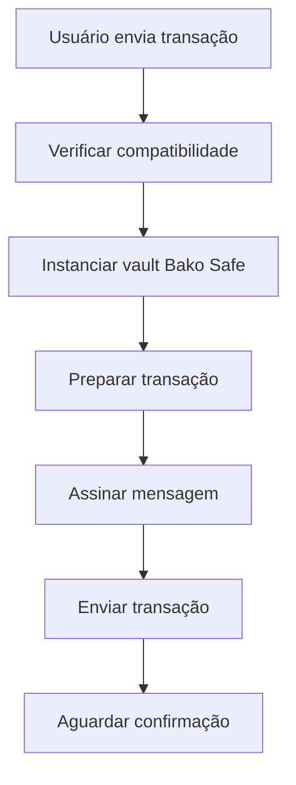

# Fuel Connectors - Sistema de Conectores para Blockchain Fuel

Este diretório contém a implementação de conectores para integração com diferentes tipos de carteiras na rede Fuel, permitindo que usuários de carteiras Ethereum interajam com aplicações Fuel através de **predicates** (contratos inteligentes de validação).

## 🎯 Objetivo

O sistema resolve o problema de **interoperabilidade** entre ecossistemas blockchain, permitindo que:
- Usuários de carteiras Ethereum (MetaMask, WalletConnect, etc.) interajam com aplicações Fuel
- Transações sejam executadas de forma segura através do sistema Bako Safe
- Diferentes tipos de carteiras sejam suportados através de uma arquitetura extensível

## 🏗️ Arquitetura

A implementação segue o padrão **Template Method** com uma arquitetura bem estruturada:

### 1. **Classe Base: `PredicateConnector`**
- **Localização**: `common/PredicateConnector.ts`
- **Responsabilidades**:
  - Gerenciamento de sessões Bako Safe
  - Lógica de autenticação e conexão
  - Controle de estado de conexão
  - Emissão de eventos
  - Gerenciamento de socket para comunicação em tempo real
  - Verificação de compatibilidade de predicates

### 2. **Subclasse Específica: `WalletConnectConnector`**
- **Responsabilidades**:
  - Integração com WalletConnect/Web3Modal
  - Gerenciamento de providers EVM e Fuel
  - Implementação específica de métodos abstratos
  - Interação com carteiras EVM (MetaMask, etc.)

### 3. **Padrões Implementados**
- **Template Method**: Classe base define o fluxo de conexão
- **Strategy**: Diferentes adaptadores para diferentes tipos de carteira
- **Bridge**: Separa abstração (conector) da implementação (carteira específica)

## 📁 Estrutura de Arquivos

```
src/connector/
├── common/                          # Infraestrutura compartilhada
│   ├── PredicateConnector.ts       # Classe base abstrata
│   ├── SocketClient.ts             # Cliente socket para Bako Safe
│   ├── types.ts                    # Tipos compartilhados
│   ├── utils.ts                    # Funções utilitárias
│   ├── networks.ts                 # Configurações de rede
│   └── index.ts                    # Exports comuns
├── wallet-connector/                # Implementação WalletConnect
│   ├── WalletConnectConnector.ts   # Classe principal do conector
│   ├── constants.ts                # Constantes e configurações
│   ├── types.ts                    # Tipos específicos
│   ├── web3Modal.ts                # Configuração Web3Modal
│   └── index.ts                    # Exports WalletConnect
├── index.ts                         # Exports principais
└── README.md                        # Documentação completa
```

## 🔄 Como Funciona

### **Fluxo de Conexão:**


### **Fluxo de Transação:**


### **Exemplo de Uso no Dapp:**
```typescript
import { WalletConnectConnector } from './connector';

// Configuração do conector
const connector = new WalletConnectConnector({
  projectId: 'your-walletconnect-project-id',
  fuelProvider: new FuelProvider('https://testnet.fuel.network'),
  predicateConfig: {
    abi: predicateAbi,
    bin: predicateBinary
  }
});

// Conectar carteira
await connector.connect();

// Enviar transação
const response = await connector.sendTransaction(
  predicateAddress,
  transactionRequest
);
```

## 🔧 Métodos Abstratos (Subclasses devem implementar)

```typescript
// Assinar mensagem usando a carteira conectada
protected abstract _sign_message(message: string): Promise<string>;

// Obter providers configurados (Fuel e EVM)
protected abstract _get_providers(): Promise<ProviderDictionary>;

// Obter endereço EVM atual da carteira conectada
protected abstract _get_current_evm_address(): Maybe<string>;

// Verificar se há conexão ativa, lançar erro se não houver
protected abstract _require_connection(): MaybeAsync<void>;

// Configurar providers baseado na configuração do conector
protected abstract _config_providers(config: ConnectorConfig): MaybeAsync<void>;

// Lógica específica de conexão da carteira
protected abstract _connect(): Promise<boolean>;

// Lógica específica de desconexão da carteira
protected abstract _disconnect(): Promise<boolean>;
```

## 🚀 Extensibilidade

Para adicionar um novo tipo de carteira:

1. **Criar nova pasta** para o tipo de carteira (ex: `solana-connector/`)
2. **Criar nova subclasse** estendendo `PredicateConnector`
3. **Implementar métodos abstratos** com lógica específica da carteira
4. **Exportar** no arquivo index apropriado

### Exemplo de Nova Implementação:
```typescript
export class SolanaConnector extends PredicateConnector {
  public name = 'Solana Wallets';
  public metadata: ConnectorMetadata = {
    image: SOLANA_ICON,
    install: {
      action: 'Install',
      description: 'Install Solana Wallet to connect to Fuel',
      link: 'https://solana.com/wallets',
    },
  };

  protected async _sign_message(message: string): Promise<string> {
    // Implementação específica para Solana
  }

  protected async _get_providers(): Promise<ProviderDictionary> {
    // Implementação específica para Solana
  }

  // ... outros métodos abstratos
}
```

## 📋 Convenções de Nomenclatura

- **Métodos abstratos**: `_snake_case` (ex: `_sign_message`)
- **Métodos públicos**: `camelCase` (ex: `sendTransaction`)
- **Métodos privados**: `camelCase` (ex: `setupEventListeners`)
- **Constantes**: `UPPER_SNAKE_CASE` (ex: `DEFAULT_NETWORK_URL`)
- **Interfaces**: `PascalCase` (ex: `WalletConnectConfig`)
- **Classes**: `PascalCase` (ex: `WalletConnectConnector`)

## 📦 Dependências

### **Core Fuel**
- **`fuels`**: SDK principal do Fuel para interação com blockchain
- **`bakosafe`**: Integração com Bako Safe para transações seguras

### **WalletConnect Ecosystem**
- **`@wagmi/core`**: Configuração de carteiras EVM
- **`@web3modal/wagmi`**: Interface de usuário para seleção de carteiras
- **`@web3modal/core`**: Funcionalidades core do Web3Modal

### **Comunicação**
- **`socket.io-client`**: Comunicação WebSocket em tempo real

## 🔒 Segurança

### **Autenticação**
- Sistema de challenge-response para autenticação segura
- Gerenciamento de sessões com IDs únicos
- Verificação de compatibilidade de predicates

### **Transações**
- Assinatura de mensagens com curva secp256k1
- Verificação de configurables antes da execução
- Integração com Bako Safe para segurança adicional

## ⚠️ Limitações e Pontos de Atenção

### **Limitações Técnicas**
- Requer ambiente com `window` e `localStorage`
- Depende de conectividade com Bako Safe API
- Limitado a carteiras compatíveis com EIP-1193

### **Pontos de Cuidado**
- Alguns erros podem requerer reconexão manual
- Subscriptions devem ser limpos adequadamente
- Operações assíncronas podem ter condições de corrida

### **Configuração**
- WalletConnect requer Project ID válido
- URLs de rede devem ser configuradas corretamente
- Configurables devem ser compatíveis

## 🧪 Testes e Desenvolvimento

### **Ambiente de Desenvolvimento**
```bash
# Instalar dependências
npm install

# Executar em modo desenvolvimento
npm run dev

# Executar testes
npm test
```

### **Configuração de Rede**
```typescript
// Configuração para testnet
const config = {
  fuelProvider: new FuelProvider('https://testnet.fuel.network'),
  chainId: 0, // Fuel testnet
  projectId: 'your-walletconnect-project-id'
};
```

## 📚 Recursos Adicionais

- [Documentação Fuel](https://docs.fuel.network/)
- [Bako Safe Repository](https://github.com/Bako-Labs/bako-safe/pull/35)
- [Web3Modal Documentation](https://docs.walletconnect.com/web3modal/about)

## 🤝 Contribuição

Para contribuir com o projeto:

1. Fork o repositório
2. Crie uma branch para sua feature (`git checkout -b feature/nova-carteira`)
3. Commit suas mudanças (`git commit -am 'Adiciona suporte para nova carteira'`)
4. Push para a branch (`git push origin feature/nova-carteira`)
5. Abra um Pull Request

## 📄 Licença

Este projeto está licenciado sob a licença MIT - veja o arquivo [LICENSE](../../LICENSE) para detalhes.

