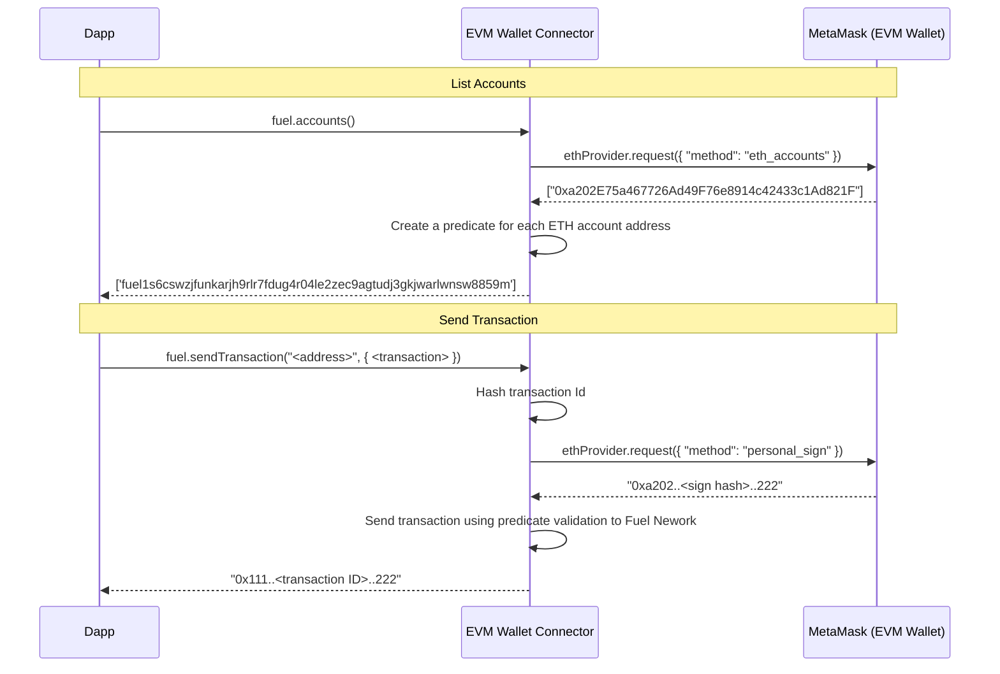

## 📗 Description

To enable the use of a MetaMask wallet on Fuel we use [Predicates](https://docs.fuel.network/docs/intro/glossary/#predicate) on Fuel Network, that allow transactions to be validated using a script.

Below we share a model that explains how our EVM Connector works.

